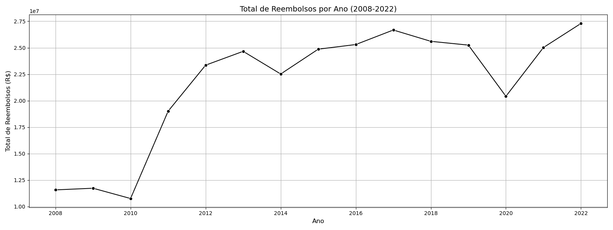
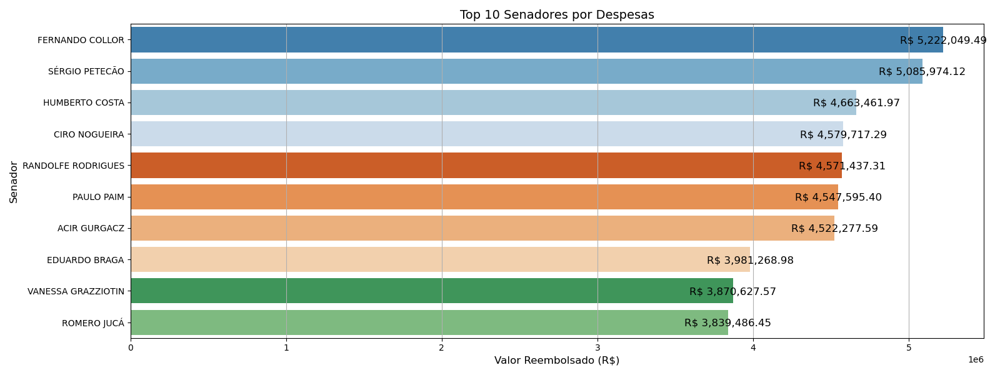
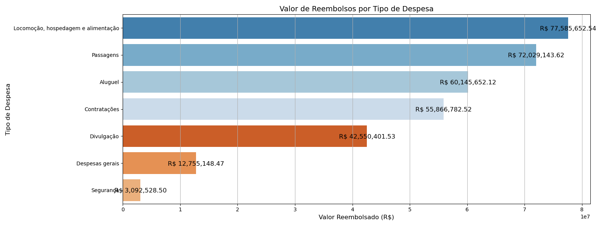
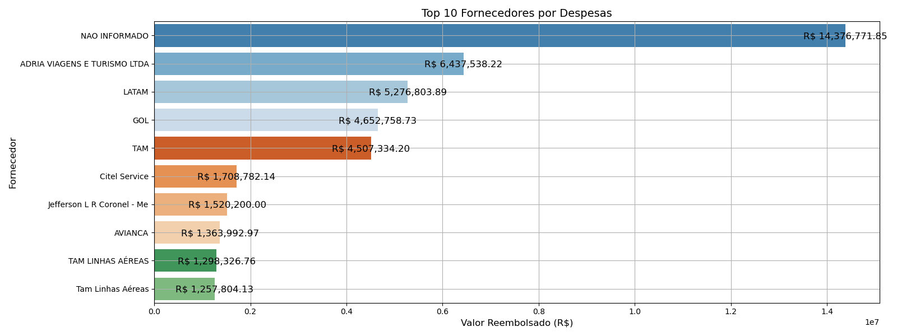
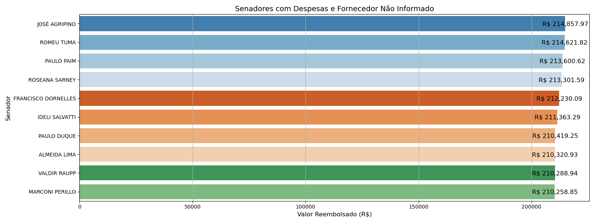

# Análise de Dados de Reembolso Parlamentar (CEAPS)

Este repositório contém um projeto de análise dos dados de reembolso parlamentar da CEAPS (Cota para o Exercício da Atividade Parlamentar) entre os anos de 2008 a 2022. O objetivo é explorar e visualizar os gastos dos senadores do Brasil com recursos públicos.

## Carregamento, Limpeza e Tratamento de Dados

Os dados foram carregados a partir de múltiplos arquivos CSV, correspondentes a cada ano entre 2008 e 2022. Em seguida, foram concatenados em um único DataFrame para análise. Foram realizadas operações de limpeza e tratamento, incluindo remoção de colunas irrelevantes, tratamento de valores nulos, padronização de nomes de fornecedores e conversão de tipos de dados.

## Análise Exploratória de Dados

### Total de Reembolsos por Ano

Foi calculado o total de reembolsos por ano e plotado um gráfico de linha para visualização da tendência ao longo do período analisado.

### Principais Senadores por Despesas

Identificamos os 10 senadores que mais receberam reembolso durante todo o período analisado e plotamos um gráfico de barras para comparação.

### Valor de Reembolsos por Tipo de Despesa

Analisamos o valor total de reembolsos por tipo de despesa e plotamos um gráfico de barras para visualização.

### Principais Fornecedores por Despesas

Identificamos os 10 principais fornecedores por valor de reembolso e plotamos um gráfico de barras para visualização.

### Senadores com Fornecedor Não Informado

Analisamos os senadores que não informaram o fornecedor em suas despesas e plotamos um gráfico de barras para visualização.

## Conclusão

Esta análise exploratória fornece insights sobre como os recursos da CEAPS foram utilizados ao longo dos anos por senadores brasileiros. Os dados brutos e o código utilizado estão disponíveis neste repositório para referência e verificação.
A destaca a importância do recurso na manutenção das atividades parlamentares e na facilitação do trabalho dos senadores. Ao fornecer transparência e detalhamento sobre a utilização dos recursos, essa análise contribui para a compreensão dos gastos públicos e a promoção da accountability no Senado Federal.

## Autor

Este projeto foi desenvolvido por [Lucas Viana Ribeiro](https://github.com/Lucasvrib).

